# 🧠 Click Health - Stroke Screening & Diagnostic Rules
## Quy tắc Tầm soát & Chẩn đoán Đột quỵ (Chuẩn Lâm sàng & Cấu hình AI)

Tài liệu này quy định chi tiết về cơ chế kiểm tra (testing mechanism), điều kiện chẩn đoán phát hiện **Nguy cơ** (Abnormal) và **Không nguy cơ** (Normal) đối với 5 chỉ số **BEFAST**, kèm theo thuật toán tính toán rủi ro đột quỵ tổng quát tích hợp trong hệ thống **Click Health**.

---

> [!IMPORTANT]
> **THỜI GIAN LÀ VÀNG (TIME IS BRAIN)**
> Đột quỵ là một cấp cứu y khoa cực kỳ khẩn cấp. Mỗi phút trôi qua khi xảy ra đột quỵ sẽ có khoảng **1.9 triệu tế bào não** bị hủy hoại. Nếu phát hiện bất kỳ một hoặc nhiều triệu chứng trong quy tắc **BEFAST**, hãy đưa bệnh nhân đến cơ sở y tế có khả năng can thiệp đột quỵ gần nhất ngay lập tức hoặc gọi cấp cứu **115**.

---

## 1. Cơ chế Kiểm tra & Điều kiện Chẩn đoán BEFAST

Quy trình BEFAST được thực hiện qua camera và microphone của người dùng, phân tích thông qua các mô hình AI thuộc máy chủ `befast-ai` (FastAPI).

### 1.1. B - Balance (Thăng bằng)
*   **Tệp tin xử lý backend:** [balance_service.py](file:///E:/EXE101/befast-ai/app/services/balance_service.py)
*   **Cơ chế kiểm tra:** Người dùng đứng lùi xa khỏi camera để thấy rõ toàn thân bao gồm đầu, vai, hông. AI sử dụng **MediaPipe Pose** để xác định tọa độ các điểm mốc: Khớp vai trái/phải (`LEFT_SHOULDER`, `RIGHT_SHOULDER`), khớp hông trái/phải (`LEFT_HIP`, `RIGHT_HIP`) và mũi (`NOSE`).
*   **Điều kiện chẩn đoán:**
    *   🔴 **Báo NGUY CƠ (Bất thường - `balance_issue: true`):**
        *   **Lệch vai:** Độ lệch vai theo trục dọc giữa vai trái và vai phải vượt ngưỡng **0.05** (`shoulder_diff > 0.05`).
        *   *HOẶC* **Nghiêng người:** Độ nghiêng lệch của trục thẳng từ Mũi tới điểm trung vị của Hông theo trục ngang vượt ngưỡng **0.10** (`body_tilt > 0.10`).
        *   *Kết quả API:* Trả về nhãn `"balance_issue"`.
    *   🟢 **Báo KHÔNG NGUY CƠ (Bình thường - `balance_issue: false`):**
        *   Cả độ lệch vai và độ nghiêng người đều nằm trong giới hạn cho phép: `shoulder_diff <= 0.05` *VÀ* `body_tilt <= 0.10`.
        *   *Kết quả API:* Trả về nhãn `"normal"` kèm lời nhắn `"Balance appears normal."`.
    *   ⚠️ **Trường hợp đặc biệt:** Không phát hiện thấy người đứng trước camera (`results.pose_landmarks` rỗng) sẽ trả về nhãn `"no_pose_detected"`.

---

### 1.2. E - Eyes (Mắt / Tầm nhìn)
*   **Tệp tin xử lý frontend:** [EyesScreen.js](file:///E:/EXE101/fe-web/src/screens/User/BeFast/EyesScreen.js)
*   **Cơ chế kiểm tra:** Do các triệu chứng về mắt đa phần mang tính cảm giác chủ quan bên trong (như mờ mắt đột ngột, mất thị lực một mắt, nhìn đôi) mà camera thông thường không thể nhận biết được, hệ thống áp dụng cơ chế **Tự đánh giá lâm sàng** (Self-assessment / Bystander survey). Bệnh nhân hoặc người thân sẽ chọn trực tiếp biểu hiện trên màn hình.
*   **Điều kiện chẩn đoán:**
    *   🔴 **Báo NGUY CƠ (Bất thường - `label: "eyes_abnormal"`):**
        *   Người dùng xác nhận có xuất hiện triệu chứng đột ngột mờ mắt, giảm thị lực hoặc nhìn một hóa hai.
        *   *Kết quả gửi đi:* Ghi nhận nhãn `"eyes_abnormal"` cùng thông báo `"Có dấu hiệu mờ mắt, giảm thị lực."`.
    *   🟢 **Báo KHÔNG NGUY CƠ (Bình thường - `label: "normal"`):**
        *   Người dùng xác nhận tầm nhìn hoàn toàn bình thường, không có bất kỳ xáo trộn thị giác đột ngột nào.
        *   *Kết quả gửi đi:* Ghi nhận nhãn `"normal"` cùng thông báo `"Tầm nhìn bình thường."`.

---

### 1.3. F - Face (Khuôn mặt - Mô hình CNN Tùy chỉnh)
*   **Mô hình AI sử dụng:** Mạng nơ-ron tích chập **CNN (Convolutional Neural Network)** đã huấn luyện (được lưu tại tệp [face_model.h5](file:///E:/EXE101/befast-ai/models/face_model.h5)).
*   **Cơ chế kiểm tra:** Người dùng chụp ảnh khuôn mặt cận cảnh. Ảnh được gửi lên máy chủ AI, tại đây hệ thống xử lý:
    1.  Tải mô hình Keras/TensorFlow từ tệp `face_model.h5`.
    2.  Tiền xử lý ảnh: Cắt, resize ảnh về kích thước **64x64** pixel (`input_shape=[64, 64, 3]`).
    3.  Chuẩn hóa các giá trị pixel về đoạn `[0, 1]` bằng cách chia `255.0` (`rescale=1./255`).
    4.  Đưa ảnh qua kiến trúc CNN gồm:
        *   Lớp tích chập **Conv2D** (32 filters, kích thước 3x3, activation "relu").
        *   Lớp lấy mẫu cực đại **MaxPool2D** (strides=2).
        *   Lớp tích chập **Conv2D** thứ hai (32 filters, kích thước 3x3, activation "relu").
        *   Lớp **MaxPool2D** thứ hai (strides=2).
        *   Lớp duỗi thẳng **Flatten** và lớp ẩn **Dense** (128 units, activation "relu").
        *   Lớp đầu ra **Dense** (1 unit, activation **sigmoid**) để đưa ra xác suất nguy cơ.
*   **Điều kiện chẩn đoán:**
    *   🔴 **Báo NGUY CƠ (Bất thường - `is_abnormal: true`):**
        *   Xác suất dự đoán đầu ra của mô hình lớn hơn **0.5** (mô hình phân loại nhị phân dự đoán nhãn là `1` - tức là `face_droop`).
        *   *Kết quả API:* Trả về nhãn `"face_droop"` kèm thông báo: `"Phát hiện dấu hiệu liệt cơ mặt từ mô hình CNN."`.
    *   🟢 **Báo KHÔNG NGUY CƠ (Bình thường - `is_abnormal: false`):**
        *   Xác suất dự đoán đầu ra của mô hình nhỏ hơn hoặc bằng **0.5** (mô hình phân loại nhị phân dự đoán nhãn là `0` - tức là `normal`).
        *   *Kết quả API:* Trả về nhãn `"normal"` kèm lời nhắn: `"Khuôn mặt cân đối bình thường."`.
    *   ⚠️ **Trường hợp lỗi:** Nếu ảnh tải lên bị hỏng hoặc không chứa khuôn mặt để xử lý sẽ báo lỗi `"Could not decode image"`.

---

### 1.4. A - Arm (Cánh tay)
*   **Tệp tin xử lý backend:** [arm_service.py](file:///E:/EXE101/befast-ai/app/services/arm_service.py)
*   **Cơ chế kiểm tra:** Người dùng đứng trước camera, thực hiện giơ thẳng cả hai cánh tay lên song song trước ngực hoặc giơ lên cao. AI sử dụng **MediaPipe Pose** để định vị khớp vai trái/phải (`LEFT_SHOULDER`, `RIGHT_SHOULDER`) và cổ tay trái/phải (`LEFT_WRIST`, `RIGHT_WRIST`).
    *   Xác định một tay có được nâng lên hay không bằng cách đối chiếu tọa độ trục Y của cổ tay xem có cao hơn vai tương ứng hay không (`wrist_y < shoulder_y` - do trong MediaPipe, gốc tọa độ Y ở đỉnh trên cùng, giá trị càng nhỏ càng ở trên cao).
*   **Điều kiện chẩn đoán:**
    *   🔴 **Báo NGUY CƠ (Bất thường - `arm_weakness: true`):**
        *   **Chỉ nâng được một bên tay:** Chỉ có tay trái nâng cao hơn vai (`is_l_raised = true` và `is_r_raised = false`) *HOẶC* chỉ có tay phải nâng cao hơn vai (`is_l_raised = false` và `is_r_raised = true`).
        *   *HOẶC* **Nâng hai tay không đều:** Cả hai tay đều được nâng lên nhưng độ chênh lệch chiều cao trục dọc giữa hai cổ tay vượt ngưỡng **0.10** (`diff > 0.10`).
        *   *Kết quả API:* Trả về nhãn `"arm_weakness"`.
    *   🟢 **Báo KHÔNG NGUY CƠ (Bình thường - `arm_weakness: false`):**
        *   Cả hai tay nâng lên đồng đều ổn định, độ lệch chiều cao hai cổ tay cực nhỏ: `diff <= 0.10`.
        *   *Kết quả API:* Trả về nhãn `"normal"` kèm lời nhắn `"Arms appear normal."`.
    *   ⚠️ **Trường hợp đặc biệt:**
        *   Nếu người dùng không giơ bất kỳ cánh tay nào lên (`is_l_raised = false` và `is_r_raised = false`), AI phản hồi trạng thái nhắc nhở: `"Please raise both arms for the test."`.
        *   Nếu không định vị được người sẽ trả về nhãn `"no_pose_detected"`.

---

### 1.5. S - Speech (Giọng nói)
*   **Tệp tin xử lý backend:** [speech.py](file:///E:/EXE101/befast-ai/app/api/speech.py) (Phối hợp ghi âm từ [SpeechScreen.js](file:///E:/EXE101/fe-web/src/screens/User/BeFast/SpeechScreen.js))
*   **Cơ chế kiểm tra:** Người dùng bấm nút ghi âm trực tiếp trên trình duyệt và đọc rõ ràng câu nói mẫu chuẩn: **`"mẹ đi chợ mua cá"`**. Chuỗi âm thanh ghi âm sẽ được gửi lên hoặc sử dụng bộ nhận diện tiếng Việt chuyển đổi giọng nói thành văn bản chữ viết (`vi-VN`), sau đó thực hiện đối chiếu chuỗi ký tự.
*   **Điều kiện chẩn đoán:**
    *   🔴 **Báo NGUY CƠ (Bất thường - `speech_issue: true`):**
        *   **Không khớp câu mẫu:** Văn bản chữ viết nhận diện được không chứa cụm từ chuẩn **`"mẹ đi chợ mua cá"`** (không phân biệt chữ hoa, chữ thường).
        *   *HOẶC* **Lỗi âm thanh/Không nhận diện được:** Gặp lỗi khi thu âm, tạp âm quá lớn dẫn đến không nghe rõ nội dung hoặc không thể chuyển hóa văn bản.
        *   *Kết quả API:* Trả về nhãn `"speech_abnormal"`.
    *   🟢 **Báo KHÔNG NGUY CƠ (Bình thường - `speech_issue: false`):**
        *   Văn bản chữ viết nhận diện được có chứa đầy đủ và chuẩn xác cụm từ **`"mẹ đi chợ mua cá"`**.
        *   *Kết quả API:* Trả về nhãn `"normal"` kèm lời nhắn `"Giọng nói bình thường."`.

---

## Tóm tắt Bảng logic phản hồi AI (BEFAST Decision Table)

| Thành phần | Cơ chế quét của hệ thống | Chỉ số kỹ thuật đo lường | Điều kiện báo **NGUY CƠ** (🔴) | Điều kiện báo **KHÔNG NGUY CƠ** (🟢) |
| :---: | :--- | :--- | :--- | :--- |
| **B - Balance** | Quét Pose (Toàn thân) | Lệch trục đứng của cơ thể & khớp vai | `shoulder_diff > 0.05` *hoặc* `body_tilt > 0.10` | `shoulder_diff <= 0.05` *và* `body_tilt <= 0.10` |
| **E - Eyes** | Tự đánh giá (Khảo sát) | Triệu chứng mờ/mất thị lực đột ngột | Người dùng chọn **Có triệu chứng** | Người dùng chọn **Không có triệu chứng** |
| **F - Face** | **Custom CNN (`face_model.h5`)** | Xác suất đầu ra dự đoán méo/liệt cơ mặt | Dự đoán xác suất từ mạng CNN **> 0.5** (`face_droop`) | Dự đoán xác suất từ mạng CNN **<= 0.5** (`normal`) |
| **A - Arm** | Quét Pose (Thân trên) | Chiều cao nâng 2 cổ tay so với vai | Chỉ giơ được 1 tay *hoặc* giơ 2 tay lệch nhau quá **10%** | Giơ 2 tay đều nhau, độ lệch cổ tay dưới mức **10%** |
| **S - Speech** | Nhận diện giọng nói (Audio) | Đối chiếu ký tự ghi âm với câu chuẩn | Chữ nhận dạng được **Không chứa** cụm từ `"mẹ đi chợ mua cá"` | Chữ nhận dạng được **Có chứa** cụm từ `"mẹ đi chợ mua cá"` |

---

## 2. Quy tắc Tính toán Chỉ số Rủi ro Đột quỵ Tổng quát

Ngoài BEFAST chẩn đoán cấp tính, hệ thống còn hỗ trợ tính toán **Chỉ số Rủi ro Đột quỵ (%)** dựa trên các thông số bệnh lý nền của người dùng (xử lý tại [stroke_service.py](file:///E:/EXE101/befast-ai/app/services/stroke_service.py)).

### Công thức tính điểm tích lũy:
$$\text{Rủi ro tổng} = \text{Rủi ro nền (1.0\%)} + \text{Điểm Tuổi} + \text{Điểm Huyết áp} + \text{Điểm Tim mạch} + \text{Điểm Đường huyết} + \text{Điểm BMI} + \text{Điểm Hút thuốc}$$

### Chi tiết các trọng số rủi ro lâm sàng:

```mermaid
gantt
    title Phân bổ Trọng số Rủi ro Đột quỵ Tích lũy (%)
    dateFormat  X
    axisFormat %s
    
    section Tuổi tác
    Dưới 40 tuổi           :active, 0, 1
    Từ 40 - 54 tuổi        :active, 0, 5
    Từ 55 - 69 tuổi        :active, 0, 12
    Từ 70 tuổi trở lên     :active, 0, 25
    
    section Bệnh nền
    Tăng Huyết áp (Hypertension) :crit, active, 0, 15
    Bệnh Tim mạch (Heart Disease) :crit, active, 0, 18
    
    section Chỉ số sinh học
    Đường huyết > 200 mg/dL :active, 0, 20
    Đường huyết 140 - 200 mg/dL :active, 0, 8
    Thể trạng béo phì (BMI >= 25) :active, 0, 12
    Thể trạng thừa cân (BMI 23 - 25) :active, 0, 5
    Thể trạng thiếu cân (BMI < 18.5) :active, 0, 2
    
    section Thói quen
    Đang hút smoke lá thường xuyên :crit, active, 0, 15
    Đã từng hút smoke lá         :active, 0, 6
```

#### A. Trọng số theo nhóm tuổi (Age)
*   **< 40 tuổi**: `+ 0.0%`
*   **40 - 54 tuổi**: `+ 5.0%`
*   **55 - 69 tuổi**: `+ 12.0%`
*   **≥ 70 tuổi**: `+ 25.0%`

#### B. Tiền sử bệnh nền
*   **Tăng huyết áp (Hypertension)**: `+ 15.0%`
*   **Bệnh tim mạch (Heart Disease)**: `+ 18.0%`

#### C. Chỉ số đường huyết trung bình (Glucose Level)
*   **Đường huyết > 200.0 mg/dL**: `+ 20.0%`
*   **Đường huyết từ 140.0 - 200.0 mg/dL**: `+ 8.0%`
*   **Đường huyết bình thường (< 140.0 mg/dL)**: `+ 0.0%`

#### D. Chỉ số khối cơ thể (BMI - Tiêu chuẩn Châu Á WHO)
*Tính toán:* $BMI = \frac{\text{Cân nặng (kg)}}{[\text{Chiều cao (m)}]^2}$
*   **Thiếu cân (BMI < 18.5)**: `+ 2.0%`
*   **Bình thường (BMI 18.5 - 22.9)**: `+ 0.0%`
*   **Thừa cân (BMI 23.0 - 24.9)**: `+ 5.0%`
*   **Béo phì (BMI ≥ 25.0)**: `+ 12.0%`

#### E. Thói quen hút thuốc lá (Smoking Status)
*   **Đang hút / Thường xuyên hút**: `+ 15.0%`
*   **Đã từng hút thuốc**: `+ 6.0%`
*   **Chưa từng hút thuốc / Khác**: `+ 0.0%`

> [!NOTE]
> Tổng điểm phần trăm rủi ro được giới hạn tối đa (**Cap**) ở mức **99.0%**.

---

## 3. Phân loại Mức độ Nguy cơ & Khuyến nghị Lâm sàng

Dựa vào điểm số rủi ro tích lũy được tính toán, Click Health phân loại thành 3 mức độ khuyến cáo:

### 🟢 MỨC THẤP (Dưới 10.0%)
*   **Đánh giá**: Nguy cơ đột quỵ trong giới hạn kiểm soát rất tốt.
*   **Khuyến nghị**: Duy trì chế độ ăn lành mạnh nhiều rau xanh, hạn chế đồ dầu mỡ và muối. Tập thể thao đều đặn ít nhất 150 phút mỗi tuần và kiểm tra định kỳ mỗi 6 tháng.

### 🟡 MỨC TRUNG BÌNH (Từ 10.0% đến 25.0%)
*   **Đánh giá**: Đã xuất hiện một số yếu tố nguy cơ tích lũy cần cải thiện.
*   **Khuyến nghị**: Giảm muối, đường và chất béo bão hòa. Tránh căng thẳng lâu ngày. **Tuyệt đối không hút thuốc lá và tránh khói thuốc thụ động.** Tầm soát đột quỵ định kỳ hàng năm.

### 🔴 MỨC CAO (Trên 25.0%)
*   **Đánh giá**: **CẢNH BÁO NGUY HIỂM.** Nhiều yếu tố bệnh lý nền đe dọa trực tiếp sức khỏe mạch máu.
*   **Khuyến nghị**: **Cần đến gặp bác sĩ chuyên khoa Tim mạch hoặc Thần kinh ngay lập tức** để kiểm tra sâu và nhận phác đồ điều trị dự phòng. Theo dõi huyết áp hàng ngày tại nhà.
